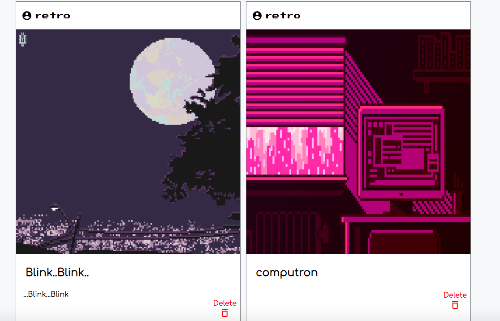

# README

You can find my site on:
[Live Demo](https://picturepixel.herokuapp.com/#/)

## About
PicturePixel is a site where users can upload pixel images with other users. On login users are sent to home feed where all images appear. They then can click other users usernames and be redirected to that user's profile.

## Technology Used
* Ruby on Rails for backend
* React.js/Redux for frontend
* PostgreSQL for database
* HTML and CSS for styling

## Features
### HomeFeed


Logged in users can scroll and view images uploaded by other users

### Upload
Logged in users can upload images


Using some JavaScript I was able to change the CSS style of the div that had the id `my-modal`. If a user clicks on the "x" the modal will disappear. Building the modal was tricky at first, but after some thinking I realized I can use a little jQuery to help me!
```javascript
  handleBtnModal() {
    return () => {
      const modal = document.getElementById('my-modal');
      modal.style.display = 'block';
    }
  }
  handleSpanModal() {
    return () => {
      const modal = document.getElementById('my-modal')
      modal.style.display = "none";
    }
  }
```
```html
  <div className="upload-cloud" onClick={this.handleBtnModal()}>
    <i id="myBtn" className="material-icons cloud photo-form-icon" onClick={this.handleBtnModal()}>cloud_upload</i>
    <p>Upload</p>
  </div>

  <div>
    <span className="close" onClick={this.handleSpanModal()}>&times;</span>
   </div>
```
### Profile


Users can view their own images uploaded and have the ability to delete the images uploaded. Some React code used to render the delete functionality. If the user is not the user who uploaded the image, there is nothing to render to the screen, so other users cannot delete other users images.
```javascript
{ photo.photographer_id === this.props.currentUser.id ?
  <div className="delete-container">
    <div>
      <button className="delete-btn" onClick={() => this.props.deletePhoto(photo.id)}>
        <div className="delete-txt">Delete</div>
        <i className="material-icons delete-icon">delete_outline</i>
      </button>
    </div>
  </div> : null }
```

The image is styled using:
```CSS
.grid-container {
  display: flex;
  flex-wrap: wrap;
  justify-content: center;
}
```
This style was chosen in order to make the design responsive to the window screen. If a user is on a smaller screen the images will stack ontop of another to have the scrolling effect on a phone.


# Future Features
* Follow feature
* Comment/Like on another image
